# 2D Image reconstruciton from projections - parallel data scanning

This notebook includes four types of inversion scheme for the inverse Radon transform from the projections in the format of parallel scanning geometry. Two most influential algorithms - Fourier reconstruction (FBP) and expectation maximization (EM) are from LA Shepp and his colleagues about half centry ago. Two other algorithms are the Hilbert transform based reconstruction schemes used by Novikov and Rullgard. For Novikov's scheme, the Chebyshev nodes are used to perform the Hilbert transform in this Python implementation. For Rullgard's scheme, the frequency-based Hilbert kernel is used to perform the inversion of finite HIlbert transform.

The references for the origin of these reconstruction schemes:
- Shepp LA and Logan B, “The Fourier reconstruction of a head section,” IEEE Trans. Nuclear Science, vol. 21, pp. 21-43, 1974.
- Shepp LA and Vardi Y, “Maximum likelihood reconstruction for emission tomography,” IEEE Trans. Medical Imaging, vol. pp.113-122, 1982.
- R. G. Novikov, “An inversion formula for the attenuated X-ray transformation,” Ark. Math., vol. 40, pp. 145-167, 2002.
- H. Rullgård, “An explicit inversion formula for the exponential Radon transform using data from 180 degrees,” Ark. Math., vol. 42, pp. 353-362, 2004.

There are many different implementations of EM algorithm in the literature. The Python implementation in this notebook is described in our early work by using a coordinate rotation technique:
- You J, Wang J, and Liang Z, “Range condition and ML-EM checkerboard artifacts,” IEEE Trans. Nuclear Science, vol. 54, pp. 1696-1702, 2007.

Two phantoms are used in the numerical experiments. One is the common Shepp-Logan phantom to study the overall contrast, resolution and intensity of the reconstruction. The other is a phantom of 9 disks to study the smallest resolution that each algorithm is able to reconize. The results of four implementations are comparable from these two phantoms.

The current Python code is the translation of original C++ code written from 2005 to 2010. The original C++ code has been published on GitHub: https://github.com/jshyou/Medical-Imaging/tree/ReconCode_CPlus.

## Setup Python libraries


```python
import numpy as np
import matplotlib.pyplot as plt
import timeit

import scipy.signal as signal

import os
code_dir ='T:\\Jason\\ImageProcessing\\recon_python'
os.chdir(code_dir)
import recon_parallel as recon
```

## Specify data acquisition geometry


```python
dim = 200
prj_view = dim
prj_bins = dim
img_size = dim
mu = 0.0

grid_rot = (np.pi/prj_view)*np.arange(prj_view)
grid_bin = (np.arange(prj_bins)-(prj_bins/2.0-0.5))*(2.0/prj_bins)
grid_che = -np.cos((np.arange(prj_bins)+0.5)*(np.pi/prj_bins))
grid_img = (np.arange(img_size)-(img_size/2.0-0.5))*(2.0/img_size)

def calib_ratio(recon, phant):
    return np.sqrt(np.sum(np.square(recon))/np.sum(np.square(phant)))
```

# Shepp-Logan phantom


```python
phant_shl = recon.image_shepplogan(img_size)[:, ::-1].T
radon_shl = recon.radon_shepplogan(grid_rot, grid_bin, mu)
radon_shl_che = recon.radon_shepplogan(grid_rot, grid_che, 0.0)
radon_shl_rot = recon.radon_rotate(phant_shl[::-1, :], grid_rot)
```

## MEM - 4-view multiplicative EM through a coordinate transform


```python
start_time = timeit.default_timer()

em_shl = recon.recon_mem(grid_rot, radon_shl_rot, img_size, epoch_max = 30, der=2, verbose=1)
em_shl = em_shl[::-1, :]
em_ratio = calib_ratio(em_shl, phant_shl)

print("\nEM calibration ratio = {:.4f}.".format(em_ratio))
print("Total processing time = {:.2f}s.".format(timeit.default_timer() - start_time))

recon.plot_image(radon_shl_rot.T, em_shl/em_ratio, phant_shl, "EM")
recon.plot_profile(grid_img, em_shl/em_ratio, phant_shl)
```

    find the contour image ...
    Time to find contour image = 1.46s.
    start iterations ...
    iteration- 1 with der = 0.53, time = 2.71s
    iteration- 2 with der = 0.77, time = 2.78s
    iteration- 3 with der = 0.92, time = 2.71s
    iteration- 4 with der = 1.04, time = 2.85s
    iteration- 5 with der = 1.13, time = 2.94s
    iteration- 6 with der = 1.21, time = 2.75s
    iteration- 7 with der = 1.28, time = 2.91s
    iteration- 8 with der = 1.35, time = 2.95s
    iteration- 9 with der = 1.41, time = 2.78s
    iteration-10 with der = 1.48, time = 2.78s
    iteration-11 with der = 1.53, time = 2.74s
    iteration-12 with der = 1.58, time = 2.69s
    iteration-13 with der = 1.64, time = 2.86s
    iteration-14 with der = 1.70, time = 2.80s
    iteration-15 with der = 1.76, time = 2.80s
    iteration-16 with der = 1.82, time = 2.75s
    iteration-17 with der = 1.88, time = 2.77s
    iteration-18 with der = 1.94, time = 2.77s
    iteration-19 with der = 2.00, time = 2.75s
    iteration-20 with der = 2.06, time = 2.70s
    complete iterations.
    
    EM calibration ratio = 0.9986.
    Total processing time = 57.27s.
    


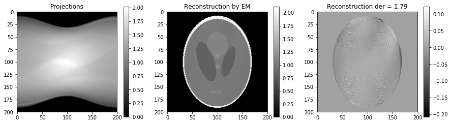


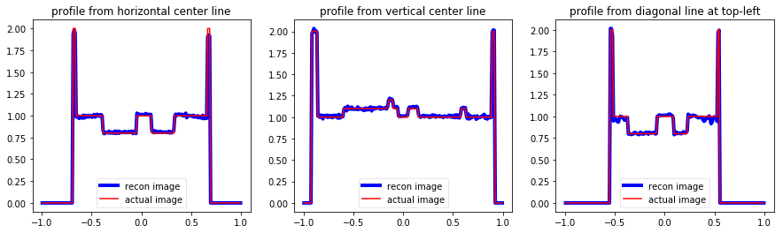


## FBP - Fourer-filtered backprojection (Shepp-Logan Fourier reconstruction)


```python
start_time = timeit.default_timer()

fbp_shl = recon.recon_fbp(grid_rot, radon_shl, img_size)
fbp_shl = fbp_shl[::-1, :]
fbp_shl[fbp_shl<0.0] = 0.0

fbp_ratio = calib_ratio(fbp_shl, phant_shl)
print("\nFBP calibration ratio = {:.4f}.".format(fbp_ratio))
print("Total processing time = {:.2f}s.".format(timeit.default_timer() - start_time))

recon.plot_image(radon_shl.T, fbp_shl/fbp_ratio, phant_shl, "FBP")
recon.plot_profile(grid_img, fbp_shl/fbp_ratio, phant_shl)
```

    start filtering projections...
    start backprojection ...
    complete reconstruction.
    
    FBP calibration ratio = 1.0202.
    Total processing time = 1.48s.
    


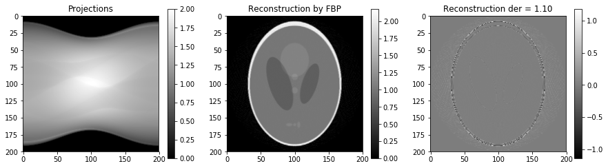


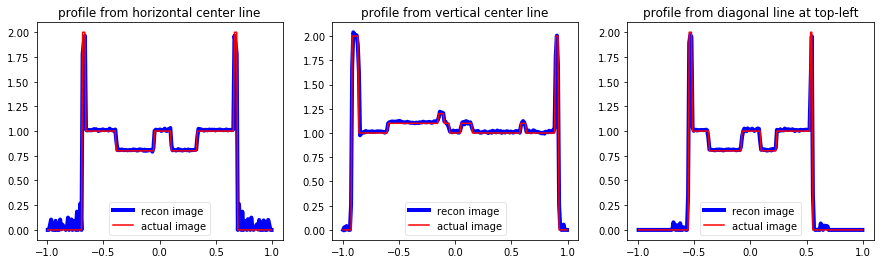


## HBP - Hilbert-filtered backprojection (Novikov reconstruction)


```python
start_time = timeit.default_timer()

chb_shl =  recon.recon_hbp_che(grid_rot, radon_shl_che, img_size)
chb_shl = chb_shl[::-1, :]
chb_shl[chb_shl<0.0] = 0.0

chb_ratio = calib_ratio(chb_shl, phant_shl)
print("\nHBP calibration ratio = {:.4f}.".format(chb_ratio))
print("Total processing time = {:.2f}s.".format(timeit.default_timer() - start_time))

recon.plot_image(radon_shl_che.T, chb_shl/chb_ratio, phant_shl, "HBP")
recon.plot_profile(grid_img, chb_shl/chb_ratio, phant_shl)
```

    start filtering projections ...
    start backprojection ...
    complete reconstruction.
    
    HBP calibration ratio = 6.3905.
    Total processing time = 1.78s.
    


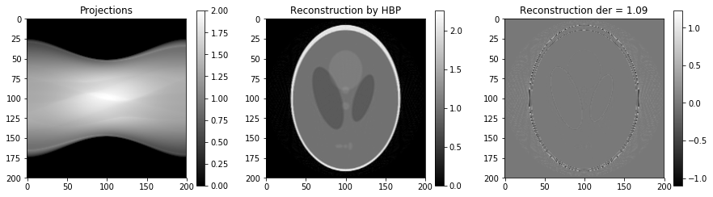


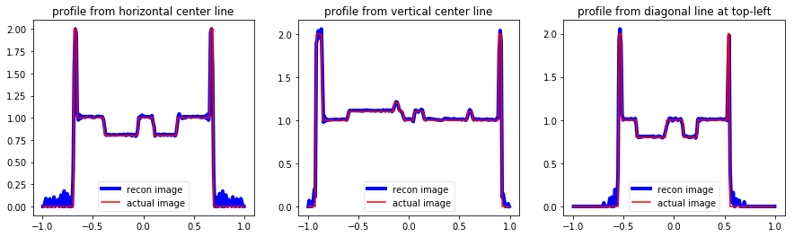


## DBH - differentiated backprojection + Hilbert (Rullgård reconstruction)


```python
start_time = timeit.default_timer()

dbh_shl = recon.recon_dbh(grid_rot, radon_shl, img_size)
dbh_shl = dbh_shl[::-1, :]
dbh_shl[dbh_shl<0.0] = 0.0

dbh_ratio = calib_ratio(dbh_shl, phant_shl)
print("\nFBP calibration ratio = {:.4f}.".format(dbh_ratio))
print("Total processing time = {:.2f}s.".format(timeit.default_timer() - start_time))

recon.plot_image(radon_shl.T, dbh_shl/dbh_ratio, phant_shl, "DBH")
recon.plot_profile(grid_img, dbh_shl/dbh_ratio, phant_shl)
```

    start calculating derivatives ...
    start backprojection ...
    complete reconstruction.
    
    FBP calibration ratio = 2.4766.
    Total processing time = 2.41s.
    


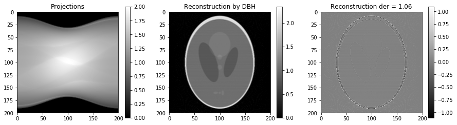


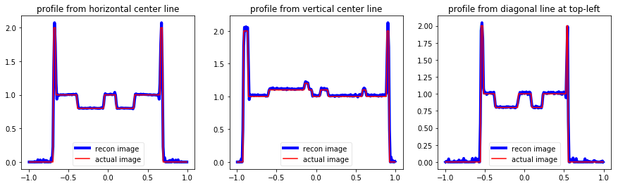


# Disk phantom


```python
disks = [[0.01, 0.5, 0.5], [0.01, -0.5, 0.5], [0.01, 0.0, 0.5], [0.01, 0.5, 0.0], [0.01, 0.0, 0.0], 
         [0.01, 0.0, -0.5], [0.01, -0.5, 0.0], [0.01, 0.5, -0.5], [0.01, -0.5, -0.5]]
phant_dsk = recon.image_disk(img_size, disks)[:, ::-1].T
radon_dsk =  recon.radon_disk(grid_rot, grid_bin, disks)
radon_dsk_che =  recon.radon_disk(grid_rot, grid_che, disks)
radon_dsk_rot = recon.radon_rotate(phant_dsk[::-1, :], grid_rot)
```

## FBP


```python
start_time = timeit.default_timer()

fbp_dsk =  recon.recon_fbp(grid_rot, radon_dsk, img_size)
fbp_dsk = fbp_dsk[::-1, :]
fbp_dsk[fbp_dsk<0.0] = 0.0

print("Total processing time = {:.2f}s.".format(timeit.default_timer() - start_time))

recon.plot_image(radon_dsk.T, fbp_dsk/fbp_ratio, phant_dsk, "FBP")
recon.plot_profile(grid_img, fbp_dsk/fbp_ratio, phant_dsk)
```

    start filtering projections...
    start backprojection ...
    complete reconstruction.
    Total processing time = 1.48s.
    


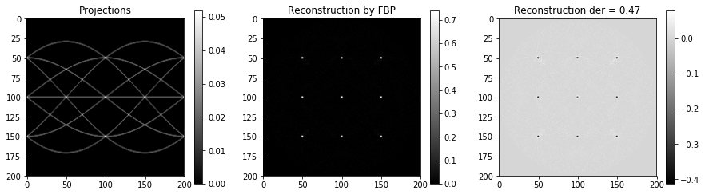


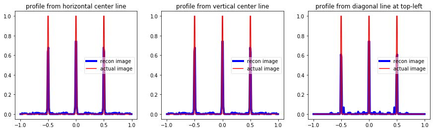


## HBP


```python
start_time = timeit.default_timer()

chb_dsk =  recon.recon_hbp_che(grid_rot, radon_dsk_che, img_size)
chb_dsk = chb_dsk[::-1, :]
chb_dsk[chb_dsk<0.0] = 0.0

print("Total processing time = {:.2f}s.".format(timeit.default_timer() - start_time))

recon.plot_image(radon_dsk_che.T, chb_dsk/chb_ratio, phant_dsk, "HBP")
recon.plot_profile(grid_img, chb_dsk/chb_ratio, phant_dsk)
```

    start filtering projections ...
    start backprojection ...
    complete reconstruction.
    Total processing time = 1.85s.
    


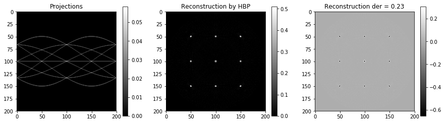


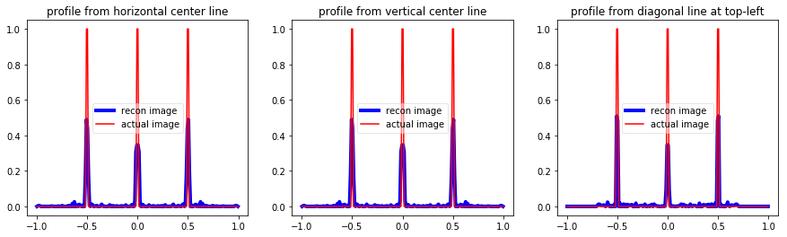


## DBH


```python
start_time = timeit.default_timer()

dbh_dsk =  recon.recon_dbh(grid_rot, radon_dsk, img_size)
dbh_dsk = dbh_dsk[::-1, :]
dbh_dsk[dbh_dsk<0.0] = 0.0

print("Total processing time = {:.2f}s.".format(timeit.default_timer() - start_time))

recon.plot_image(radon_dsk.T, dbh_dsk/dbh_ratio, phant_dsk, "DBH")
recon.plot_profile(grid_img, dbh_dsk/dbh_ratio, phant_dsk)
```

    start calculating derivatives ...
    start backprojection ...
    complete reconstruction.
    Total processing time = 2.42s.
    


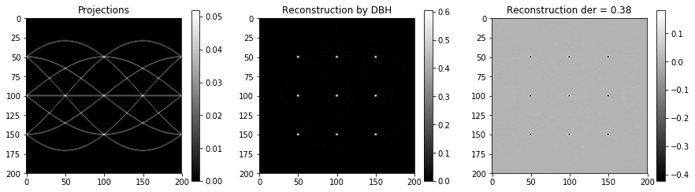


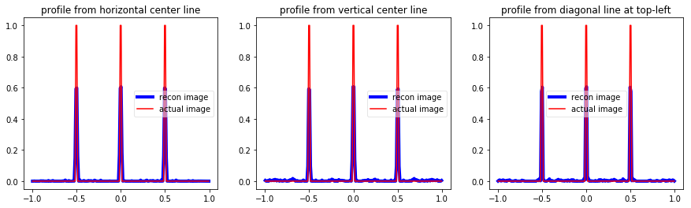


## MEM


```python
start_time = timeit.default_timer()

em_dsk =  recon.recon_mem(grid_rot, radon_dsk_rot, img_size, epoch_max = 30, der=3)
em_dsk = em_dsk[::-1, :]

print("Total processing time = {:.2f}s.".format(timeit.default_timer() - start_time))

recon.plot_image(radon_dsk_rot.T, em_dsk/em_ratio, phant_dsk, "DBH")
recon.plot_profile(grid_img, em_dsk/em_ratio, phant_dsk)
```

    find the contour image ...
    Time to find contour image = 1.45s.
    start iterations ...
    iteration- 2 with der = 14.91, time = 5.49s
    complete iterations.
    Total processing time = 6.94s.
    


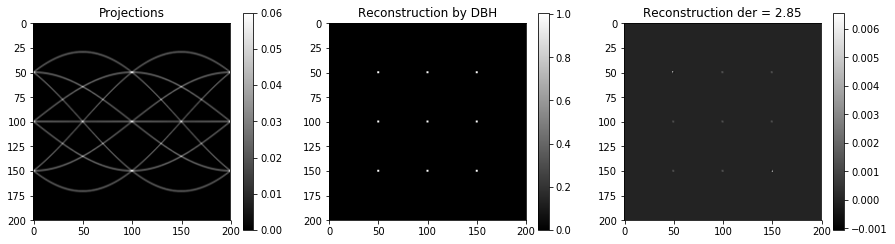


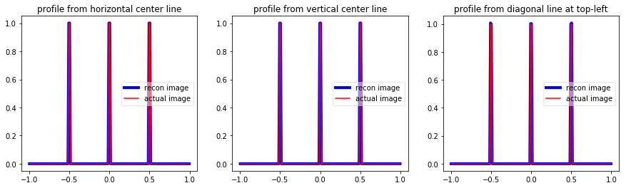


```python

```
